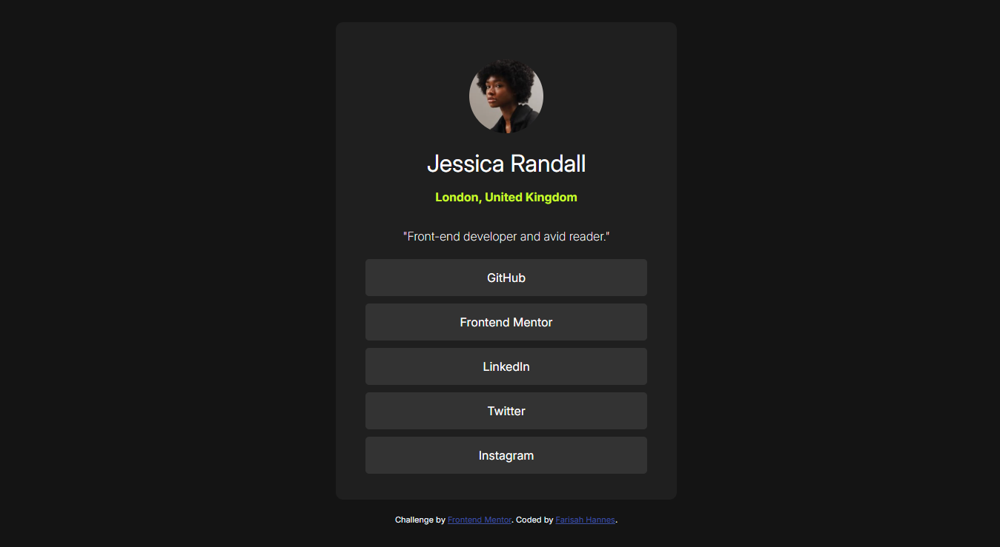

# Frontend Mentor - Social links profile solution

This is a solution to the [Social links profile challenge on Frontend Mentor](https://www.frontendmentor.io/challenges/social-links-profile-UG32l9m6dQ). Frontend Mentor challenges help you improve your coding skills by building realistic projects. 

## Overview

### The challenge

Users should be able to:

- See hover and focus states for all interactive elements on the page

### Screenshot

### Links

- Solution URL: [Solution URL](https://github.com/FarisahHannes2210/Social-links-profile-frontend-mentor)
- Live Site URL: [live site URL](https://FarisahHannes2210.github.io/Social-links-profile-frontend-mentor)

## Author

- Website - [Farisah Hannes](https://sites.google.com/view/farisahhannes/)
- Frontend Mentor - [@FarisahHannes2210](https://www.frontendmentor.io/profile/FarisahHannes2210)

